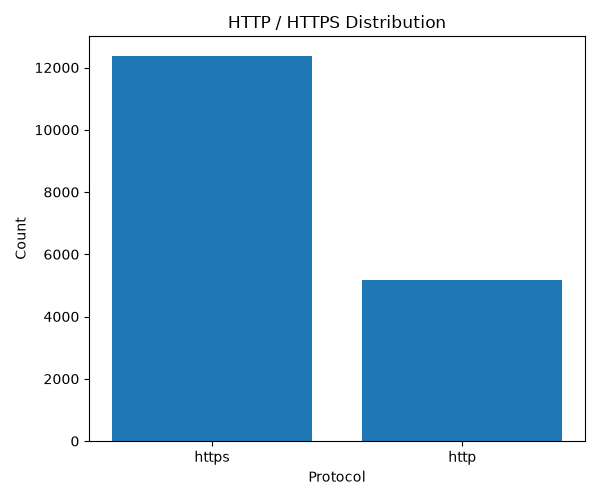
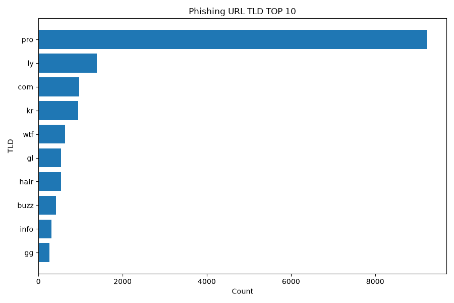

# 피싱사이트 URL 분석

SK Shieldus Rookies 35기 10조 Python 프로젝트

공공데이터포털의 피싱사이트 URL 데이터를 수집해 MongoDB에 저장하고,
전처리·통계·시각화를 거쳐 Flask 웹 화면으로 보여줍니다.

## 데이터

- 출처: 공공데이터포털 「한국인터넷진흥원_피싱사이트 URL」 (2023년 데이터 기준)
- API: `https://api.odcloud.kr/api/15109780/v1/uddi:707478dd-938f-4155-badb-fae6202ee7ed`
- 항목: `날짜`, `홈페이지주소`

## 처리 흐름

| 단계 | 모듈 | 함수 | 결과 |
| --- | --- | --- | --- |
| 1. 수집 | `collector/fetch_api.py` | `fetch_and_save()` | 원본을 MongoDB에 저장, `(컬렉션명, 문서 ID)` 반환 |
| 2. 전처리 | `preprocessing/preprocess.py` | `preprocess(collection_name, mongo_id)` | 중복 제거·마스킹된 DataFrame |
| 3. 통계 | `storage/save_data.py` | `check_https_http(df)`, `check_tld_num(df)`, `save_csv(df, file_path)` | 프로토콜 여부 열, TLD별 건수, CSV 파일 |
| 4. 시각화 | `visualization/charts.py` | `save_protocol_chart(stats)`, `save_domain_chart(stats)` | `static/charts`의 PNG 2개 |
| 5. 화면 | `app.py`, `templates/index.html` | `[라우트]` | 결과 페이지 |

## 폴더 구조

```
project/
├── app.py                  # Flask 실행 진입점
├── collector/
│   └── fetch_api.py        # 공공데이터 API 호출, MongoDB 저장
├── preprocessing/
│   └── preprocess.py       # 중복 제거, 마스킹, 도메인·TLD 추출
├── storage/
│   └── save_data.py        # http/https 분류, TLD 집계, CSV 저장
├── visualization/
│   └── charts.py           # 차트 이미지 생성
├── templates/
│   └── index.html
├── static/charts/          # 생성된 차트 이미지
└── data/processed/         # 저장된 CSV
```

## 실행 방법

### 준비

- Python 3.11 이상
- 로컬에서 실행 중인 MongoDB
- 공공데이터포털 인증키 (위 API 활용 신청 후 발급)

### 설치

```bash
pip install -r requirements.txt
```

### 환경 변수

`.env.example`을 복사해 `.env`를 만들고 값을 채웁니다.

| 변수 | 설명 |
| --- | --- |
| `PUBLIC_DATA_TOKEN` | 공공데이터포털 일반 인증키 (Decoding) |
| `PUBLIC_DATA_URL` | 위 API 주소 |
| `MONGO_URI` | MongoDB 접속 주소 (예: `mongodb://localhost:27017`) |
| `MONGO_DB_NAME` | 사용할 DB 이름 |

### 실행

```bash
python project/app.py
```

브라우저에서 localhost:5000로 접속합니다.


## 단계별 데이터 형식

### 1. MongoDB 원본 문서

수집 1회가 문서 1개입니다.

```
{
    "_id": ObjectId,
    "fetched_at": datetime,     # 수집 시각 (초 단위)
    "total_count": int,         # items 개수
    "items": [{"date": str, "url": str}, ...]
}
```

### 2. 전처리 결과

| 열 | 설명 |
| --- | --- |
| `date` | 날짜 |
| `month` | 연-월 (예: `2023-01`) |
| `masked_url` | 마스킹된 URL (`http` → `hxxp`, `.` → `[.]`) |
| `domain` | 도메인 |
| `tld` | 최상위 도메인. IP 주소는 `IP` |

처리 순서: 결측 제거 → 표기 통일(공백, 소문자, 끝 슬래시) → URL 기준 중복 제거
→ 도메인·TLD 추출 → 마스킹 → 날짜 변환. 원본 URL은 결과에 남기지 않습니다.

### 3. 통계

- `check_https_http`: 전처리 결과에 `https`, `http` 열(True/False)을 추가합니다.
  프로토콜 표기가 없는 주소는 둘 다 False입니다.
- `check_tld_num`: `tld`, `count` 두 열의 표를 반환합니다.
- `save_csv`: `utf-8-sig` 인코딩으로 저장하고 성공 여부를 반환합니다.

### 4. 차트

| 파일 | 내용 |
| --- | --- |
| `protocol_chart.png` | http / https 건수 세로 막대그래프 |
| `domain_chart.png` | TLD 상위 10개 가로 막대그래프 |

## 분석 결과

| 항목 | 값 |
| --- | --- |
| 수집 건수 | [ 약 27,000 건 ] |
| 중복 제거 후 건수 | [ 약 17,000 건  ] |
| https 비율 | [ 약 70 % ] |
| 가장 많은 TLD | [ .pro ] (약 52%) |

## 분석 차트



## 인사이트
1. 프로토콜이 HTTPS 가 약 70% 로 대다수. HTTPS 가 웹사이트 자체의 안전을 보장할 순 없다.
2. .pro 로 끝나는 URL 이 대다수. 생소한 TLD 의 URL 은 접속을 지양하는 것이 안전하다.

## 팀원

| 이름 | 담당 | 브랜치 |
| --- | --- | --- |
| [ 오준영 ] | 수집 | `joonyoung` |
| [ 최경규 ] | 전처리 | `rudrb` |
| [ 박정민 ] | 통계·CSV 저장 | `jeonogmin` |
| [ 이은빛 ] | 시각화 | `eunbit` |
| [ 김민석 ] | Flask 화면 및 병합 | `minseok` |